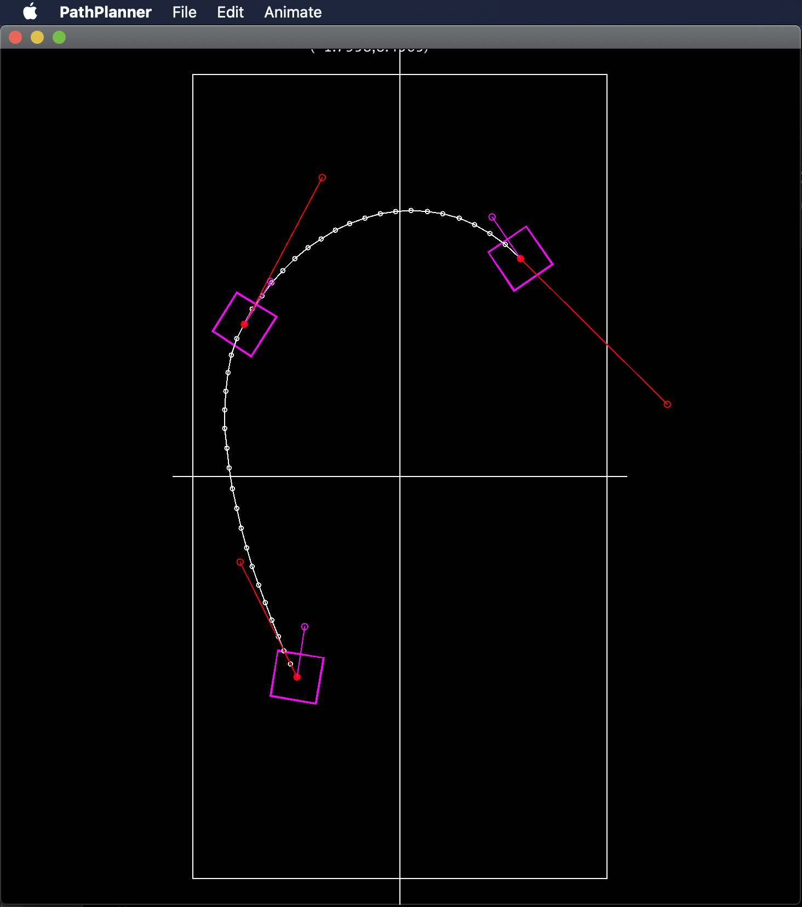
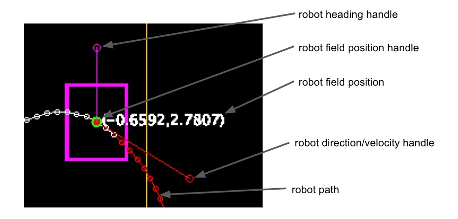
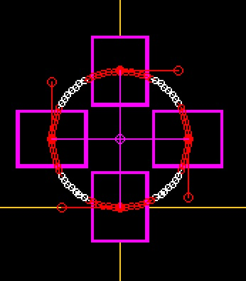
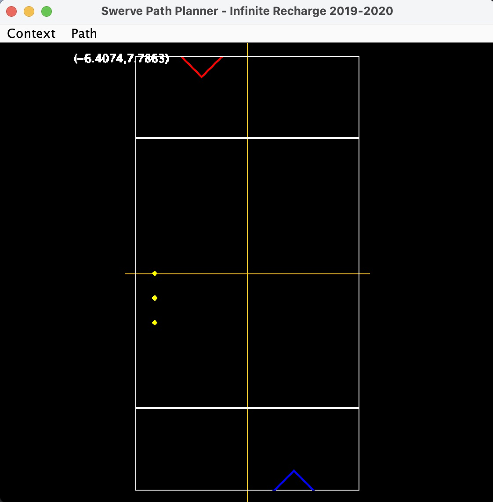

* **version:** 0.9.6
* **status:** used for FRC **2024 Crescendo**, **2023 Charge Up**, **2022 Rapid React**, and **2021 Infinite Recharge at home**
* **comments:** We believe this is competition-ready (i.e. we've used this for competition since the 2020-2021
  season). This release adds ring field elements, and improved documentation.
* **related releases:**
  * [a05annexUtil](https://github.com/A05annex/a05annexUtil) - the utility library that supports various A05annex
    projects including this swerve path planner and all of our robot competition code.
  * [a05annexRobot](https://github.com/A05annex/a05annexRobot) - our common robot code that includes the MK4 swerve
    base, NavX, driver and autonomous selection switch panel, autonomous path and driver commands, camera, etc.
  * [a05annexTemplate](https://github.com/A05annex/a05annexTemplate) - our template, built on the wpilib template
    that provides a driveable swerve base with NavX, camera, autonomous path and driver selection.

# 6831 A05annex: Swerve Path Planning


This project is a visual 2D editor for path planning for a swerve drive FRC robot. You read a field description
and robot description into this planner as a context for path planning; then draw, tune, add commands, and
save paths that can be used as the autonomous programs for a match.

A05annex is committed to using the internationally recognized SI units, so the field, robot, and path
descriptions, and path points are in SI units. The +Y axis is always downfield from the driver (as Y is
the forward/backward axis of control sticks and the vertical or forward axis when the field map is laid
down in front of the driver), Specifically, the driver is at the bottom of the screen. The +X axis is
always to the right (common engineering convention). We adopted
the convention that the center of the competition field is (0.0,0.0) for red-blue alliance symmetry; and
that the left corner closest to the driver is 0,0 for the 2021 at Home field - both of which are reflected
in our field descriptions for the 2021, 2022, and 2023 competitions.

## Change Log

<details>
  <summary>version 0.9.6 to 0.9.? (for <b>2024 Crescendo</b>):</summary>

  * added <b>2024 Crescendo</b> field description, and 2024 robot descriptions;
</details>
<details>
  <summary>version 0.9.0 to 0.9.5 (for <b>2023 Charged Up</b>):</summary>

  * added <b>2023 Charged Up</b> field description, and 2023 robot descriptions;
  * added <tt>scale</tt> for field components to support mirroring the red and blue side of the field;
  * added dialog editing of the rotation speed at control points. There is currently no interactive graphical
    editing of rotation because we have not found a good way to present an editing handle for rotation speed;
  * Fixed a timing issue that sometimes threw exceptions when path animation started;
  * Fixed error in path point info dialog where Field Y was incorrectly reporting field X, added X, Y, and rotation
    speed to the reported path point information;
  * added saved Idea run configurations;
  * improved user documentation.
</details>
<details>
  <summary>version 0.8.0 to 0.9.0 (for <b>2022 Rapid React</b>):</summary>

  * added *stop-and-run* commands for control points and *scheduled commands* for path points. See
    [Running Commands Along The Path](#Running-Commands-Along-The-Path);
  * robots often have *appendages*, like a collector or hangar, that extend past to robot periphery
    and must be considered in path planning - appendages were added to
    the [Robot Description](#Robot-Description);
  * while there is an 'FRC standard field', different competitions like **2020 Infinite Recharge**,
    **2021 At Home**, and **2022 Rapid React** have configured this to different sizes and/or
    restricted the portion of the field where autonomous action can happen. To adapt, we moved the field boundary
    description from the *Swerve Path Planner* constants to the [Field Description](#Field-Description)
    as the <tt>"arena"</tt> description. The <tt>-ah</tt> command argument was removed because field
    extents are now in the field description rather than programmed. All field descriptions
    in <tt>./resources/fields</tt> have been updated to include an <tt>"arena"</tt> description;
  * minor changes for better interactive editing feedback and response.
</details>

## Download and/or Run

We have finally packaged this as a runnable *.jar* file. So you now have the
option to:
* Download and run from the *.jar* file;
* Clone the project and run from an IDE, which gives you all of our field, robot,
  and path data files for reference.

### Just Download and Run

In github you will find an 0.9.5 release of the *SwervePathPlanning-0.9.5-all.jar*
which you can run at the command line as:
```
% java -jar SwervePathPlanning-0.9.5-all.jar
```
See notes in the next section about command line arguments. While this is a running
program, it lacks data for field, robot, or path descriptions; so, you may want to
clone the project (or just download and expand the *.zip* just so you have all of our past
field, robot, and path descriptions as sample data.

### Clone Source and Run
Even though we have packaged this as a runnable *.jar* file, you may want to
clone the repository and open it in your favorite IDE (Intellij IDEA or
Visual Studio) and create a run target for `ServePathPlanner` (if you are using Idea, the run targets
will be loaded when you load the project). The gradle build file will resolve the
dependencies, build, and run the program.

When you run the program it will initialize with a default view of the most recent competition field
without any field elements. You can add some
commandline arguments to the run target to get your desired field and robot to load automatically.
Run with the `-h`
or `--help` command line option to get program help:
```
usage: PathPlanner [-h] [-r ROBOT] [-f FIELD]

Swerve Drive Path Planner

named arguments:
-h, --help                  show this help message and exit
-r ROBOT, --robot ROBOT     specify a robot description file
-f FIELD, --field FIELD     specify a field description file
```
Our fields, robots, and paths from previous years are in the <tt>resources</tt> folder of the project.

## Path Spline

<details>
  <summary>The path planner uses an implementation of the
  <a href="https://en.wikipedia.org/wiki/Kochanek%E2%80%93Bartels_spline">Kochanek-Bartels Spline</a> modified
  for interactive editing of the tangent vector to implicitly control bias and tension. There is no
  continuity control because we want our robot paths to be continuous. The original reference for this
  spline can be found at
  <a href="https://www.engr.colostate.edu/ECE455/Readings/TCB.pdf">
  Interpolating Splines with Local Tension, Continuity, and Bias Control</a>.
  </summary>
<br>
When control points are created the tangent (derivatives) at that control point and surrounding
control points are computed/recomputed using the [Cardinal-Spline](https://en.wikipedia.org/wiki/Cubic_Hermite_spline)
formulation with the default tension specified by a program constant. The tangent is adjusted using a
control handle which intuitively manipulates the shape of the spline at the control point to implicitly
edit tension and bias.
</details>

## Creating and Editing a Path

<details><summary>
A path is created by dropping successive <i>control points</i> along the path onto the diagram of the field. Once the
control points have been dropped, the path is edited and adjusted by: modifying positions and path derivatives
at the control points; adding control points; removing control points; and attaching action commands to the
path.</summary>

### Initial Path Creation

When the path planner is started it shows, by default, the full 2022 field boundary
with no field elements (see <a href="#Field-Description">Field Description</a> for loading a specific field
and elements); and will use a default robot chassis that is 0.9m long and 0.5m wide; and 1.1m
long amd 0.7m long with bumpers (see <a href="#Robot-Description">Robot Description</a> for loading
a description of your robot).
<p>
The display starts in <i>path creation mode</i>. Each time you click on the field a control point will be
created at that position. A <i>double-click</i> will end the path at the control point created there
and switch to <i>path edit</i> mode. Alternately, you can <i>right-click</i> to get a
context-sensitive menu, and select <b>End Path</b> to end the path at the last created control point,
and switch to <i>path edit</i> mode.

### Playing the Path

An animation of the robot following the path can be *played* in two ways:
<ul>
<li>From the main menu, under <b>Path</b>, select <b>Play Path</b></li>
<li>From the context menu (right-click anywhere to get the context menu), select <b>Play Path</b></li>
</ul>
This will animate the robot following the path at actual speed/timing.

### Editing the Path

<details><summary>
Once you create a path, really a first guess at the path by dropping a few control points, you go immediately
into path tuning (editing). Generally, the questions and adjustments are around:
<ul>
<li>Is this really the path I meant, and, can I fix it?;</li>
<li>Is the robot capable of following the path, and if not, how do I fix it?;</li>
<li>Is the robot facing the right direction, and if not, how do I fix it?;</li>
<li>How do I tell the robot to do something in addition to following the path?;</li>
<li>How can I optimize timing or speed for a faster (better) path?</li>
</ul>
Expand this section to get answers for these questions.
</summary>

#### What is a Control Point?

A control point is a position on the field that the path will pass through at a specified time with a specified
velocity, direction, and rotation speed. Each time you drop a new control point it is, by default, 1 second further along the
path than the last control point. At the control point you will see editing handles for: position on the field;
direction and velocity; and field orientation of the robot as shown below.


As you move the cursor you will always get the *field position* feedback with the cursor. If you are over an
editing handle, the handle will be surrounded by a green circle. In the figure above, the cursor is above the
control point position handle. When you are above a handle (it has a green circle) you can left-click and
drag the handle to edit that parameter (field position, direction and velocity,
robot heading) at that control point.

NOTE that as you edit the control point, the robot path will reflect those edits. The robot path will be colored
to describe things you should consider:
* **white** - this is a valid robot path;
* **red** - this path is asking the robot to perform beyond its capabilities - specifically, you are asking at
  least one module to go faster than is possible;
* **orange** - this path is in danger of crashing (or will crash) into the field perimeter.

### Clearing a Bad Path and Restarting Path Creation

We all do some testing, drop some points, create a path, and say "Good experiment, delete that and let's start
over". This is how we do that:
<ul>
<li>From the main menu, under <b>Path</b>, select <b>Clear Path</b></li>
<li>From the context menu (right-click anywhere to get the context menu), select <b>Clear Path</b></li>
</ul>
This will clear any loaded or created path from the path planner, and you will lose any edits made since the last
time you saved the path. The path planner will be placed in path creation mode and you can start dropping cointrol
points for the new path.

### Reshaping the path

<details><summary>There are 2 primary approaches to reshaping a path:
<ul>
<li>Edit (move, change direction and/or velocity and heading) at control points of the existing path;</li>
<li>Add or remove control points.</li>
</ul>
</summary>

#### Editing a Control Point

In the previous <a href="#What-is-a-Control-Point">What is a Control Point</a> section, the handles are your
way to interactively edit the curve around a control point. Specifically:
<ul>
<li><i>position handle</i> - moves the control point, the point the path goes though, on the field;</li>
<li><i>direction/velocity handle</i> - shapes the curve around the point;</li>
<li><i>robot heading handle</i> - changes the heading of the robot as it goes through that control point.</li>
</ul>
It is useful to play with these on a test path to get a better idea how the handles control and shape the path.

#### Adding and Removing Control Points

Often you will find that as you edit and reshape your path you will be moving too many control points and want to
delete control points that are superfluous; or, You need finer control somewhere along the path, and you want to
add a control point. Here is how you do that:
<ul>
<li>Removing a Control Point:
<ul>
<li>right click on the <i>field position handle</i> of the control point;</li>
<li>from the context menu, select <b>Delete Control Point</b>. The control point will be deleted, and
the timing for all other control points will remain unchanged.</li>
</ul></li>
<li>Adding a Control Point:
<ul>
<li>right click on the path point where you wnt to add a control point;</li>
<li>from the context menu, select <b>Insert Control Point</b>. A control point will be added at that path
point with the timing and other parameters of that path point. This should produce minimal disturbance of
the current path and give you additional control point for path tuning.</li>
</ul></li>
</ul>

</details>

### Editing Timing along the Path

<details><summary>
There are 2 ways to adjust path timing:
<ul>
<li>Re-time a control point in the path;</li>
<li>Re-time the entire path.</li>
</ul>
</summary>

#### Re-timing a Single Control Point

When you initially drop control points to define a path, each new control point is set to be 1 second from the
last. Often, you will need a couple control points close together to control motion around some field obstacle,
and the 1 second spacing between control points is not at all what you want. You can change the time for an individual
control point, which will reset the timing for all subsequent points so they have the same relative timing.

For example, suppose my robot needs to move forward 2m, then take a .25m left jog, and move forward again. I create a
path with a start point, a 2nd control point immediately before the jog, a 3rd control point immediately after the
jog, and then a 4th control point another 2m forward. These 4 points are assigned an initial timing of 0sec, 1sec,
2sec, and 3sec respectively. When you play the path you will see the robot slow to a crawl between control points 2
and 3 - not at all what you wanted.

What you really want is for control points 2 and 3 to be closer together in time so the robot maintains its speed
as it makes the jog, so instead of control point 3 being crossed in 2sec, you want to cross it in 1.3sec. Let's
change the time the robot crosses point 3 to 1.3sec:
<ul>
<li>right click on the <i>field position handle</i> of the 3rd control point;</li>
<li>from the context menu, select <b>Info</b>, this will bring up a control point information dialogue;</li>
<li>in the control point information dialogue, edit the <b>At Time</b> from 2 to 1.3, and <b>apply</b> this
change. The 3rd control point and all subsequent points have now had their time adjusted, which should
be reflected when you play the path.</li>
</ul>

#### Re-timing the Entire Path

It is common to start path planning with a path that is slower than the best the robot could achieve to
make tuning easier, and make it less damaging to the robot and test arena if the path does not go as
expected. Once the path is working pretty well, we often want to turn up the speed and continue to tune
until we get maximum robot performance. The path planner provides a speed multiplier to accommodate this
need. The speed multiplier defaults to 1.0. To change the speed multiplier, from the main menu, under <b>Path</b>
select <b>Speed Multiplier</b> to bring up a dialogue for changing the multiplier.

Note that when you change the speed multiplier, the red path highlights for paths that are beyond the capability
of the robot will change to reflect the new speed profile, encouraging you to tune control points to keep the
path within the robot capabilities.

</details>

</details>

### Running Commands Along The Path
<details><summary>
In the <b>2021 At Home Challenges</b>, the obstacle course challenges merely required a path. For the <b>2022
Rapid React</b> competition it became obvious we needed the paths to include other actions (commands) that needed to
run at various points on the path (like <i>start/stop-collector</i>, or <i>aim-and-shoot</i>). So the
<code>AutonomousPathCommand</code> run on the robot is really a dynamically configured (configured when the path is
executed) Command Group.

Two types of commands are supported:
<ul>
<li>A Command that is scheduled to execute at a specif point along the path the robot is following, e.g.
  start/stop the collector rollers;</li>
<li>A command that happens at a control point where the robot stops, the path follower relinquishes
  control of the swerve drive, and path following resumes at the completion
  of the command. An example of this would be a command that aims the shooter at a target, spins-up 
  the shooter rollers, and takes a shot.</li>
</ul>
</summary>

#### Scheduled Commands ####

<i>To be written</i>

#### Stop-And-Run Commands ####

<i>To be written</i>

</details>

</details>

## Path Description Format

<details>
  <summary>Paths are saved in <code>.json</code> files that can be loaded to the robot for execution by the
  <code>AutonomousPathCommand</code>.
  </summary>

The path is saved as a list of control points in a dictionary with these keys:
- **<tt>"title"</tt>**: (optional, string) A title or name for the path, primarily used as file documentation
  to refresh you on the path this file represents.
- **<tt>"description"</tt>**: (optional, string) A more verbose description if the path, again primarily used as file
  documentation to refresh you on the path this file represents.
- **<tt>"controlPoints"</tt>**: (required, list) The list of control points. A control point is a dictionary
  containing these fields:
  - **<tt>"fieldX"</tt>**: (optional, double, default=0.0) The field X position in meters.
  - **<tt>"fieldY"</tt>**: (optional, double, default=0.0) The field Y position in meters.
  - **<tt>"fieldHeading"</tt>**: (optional, double, default=0.0) The field heading in radians.
  - **<tt>"time"</tt>**: (optional, double, default=0.0) The time at which this control point should be reached.
  - **<tt>"derivativesEdited"</tt>**: (optional, boolean, default=<tt>false</tt>) Whether the derivatives of the
    control point velocities have been explicitly set (usually by manipulating the direction/velocity handle for
    the control point). If <code>false</code>, then the X,Y velocities at the control point are set
    algorithmically at load and when the control point is moved. If <code>true</code> then the X,Y velocities specified
    here are used for the control point.
  - **<tt>"field_dX"</tt>**: (optional, double, default=0.0) The field X velocity in meters per second.
  - **<tt>"field_dY"</tt>**: (optional, double, default=0.0) The field Y velocity in meters per second.
  - **<tt>"HeadingDerivativeEdited"</tt>**: (optional, boolean, default=<tt>false</tt>) Whether the derivative of the
    control point heading has been explicitly set. If <code>false</code>, then the heading derivative at the control
    point is set algorithmically. If <code>true</code> then dHeading specified here is used for the control point.
  - **<tt>"field_dHeading"</tt>**: (optional, double, default=0.0) The field angular velocity in
    radians per second. Currently, ignored as the derivative is always generated from the headings of the adjacent
    control points.
  - **<tt>"robotActionCommand"</tt>**: (optional, string) The action command to run once the robot stops
    at this control point. This command may require the **<tt>a05annex/src/subsystems/DriveSubsystem</tt>**. If
    this command does not finish, the rest of the path will not be run. If not specified, no robot action will
    be run at this control point.
  - **<tt>"robotActionDuration"</tt>**: (conditional, double) Required if **<tt>robotActionCommand</tt>** is
    specified. This is the expected duration (in seconds) of the **<tt>robotActionCommand</tt>** and is used
    only in the pat planner to pause path following at the control point for this time in order to simulate
    the actual timing when the path is played for planning.
- **<tt>"speedMultiplier"</tt>**: (optional, string, default=1.0) The speed multiplier for the path. If greater than
  1.0 the robot will be moving faster along the path.
- **<tt>"robotScheduledActions"</tt>**: (optional, list) The list of scheduled actions. A scheduled action is a
  dictionary containing these fields:
  - **<tt>"robotActionCommand"</tt>**: (required, string) The action command to be scheduled at
    **<tt>robotScheduledActionTime</tt>**. This command must not require the
    **<tt>a05annex/src/subsystems/DriveSubsystem</tt>**.
  - **<tt>"robotScheduledActionTime"</tt>**: (required, double) The time along the path when the
    **<tt>robotActionCommand</tt>** will be scheduled to run.
  

  
#### Path Description Examples

<details>
<summary>
This is the path description for a 2m diameter calibration path (see the
<code>./resources/paths/test_circle_2m.json</code> path):
</summary>

```json
{
  "description": "2m diameter test circle.",
  "title": "The path for a 2 meter diameter test circle with the robot facing the center of the circle.",
  "controlPoints": [
    {
      "fieldY": 0.0,
      "fieldX": 0.0,
      "fieldHeading": 0.0,
      "time": 0.0
    },
    {
      "fieldY": 1.0,
      "fieldX": -1.0,
      "fieldHeading": 1.5708,
      "time": 1.0
    },
    {
      "fieldY": 2.0,
      "fieldX": 0.0,
      "fieldHeading": 3.1416,
      "time": 2.0
    },
    {
      "fieldY": 1.0,
      "fieldX": 1.0,
      "fieldHeading": 4.7124,
      "time": 3.0
    },
    {
      "fieldY": 0.0,
      "fieldX": 0.0,
      "fieldHeading": 6.2832,
      "time": 4.0
    }
  ]
}
```
When loaded into the path planner, the path looks like this:<br>

<p>
Note that the path is defined using positions, velocities, and time. When the path is processed by the robot
code that information is translated to drive commands.

</details>
</details>

### Using a Path Description in the Robot Autonomous

*To be written.*

## Robot Description

<details>
  <summary>The robot is described in a <code>.json</code> file read into the path planner and displayed as the robot during
  the path planning, as well as providing the drive geometry and max speed for the modules of the swerve
  drive.
  </summary>
Having a good description of the robot is helpful in identifying when the planned path exceeds the
capability of the robot (i.e. it just cannot go that fast), and detecting collisions or near collisions
between the robot and game elements.

### Robot Description Format

The robot description has **<tt>"title"</tt>** and **<tt>"description"</tt>** elements, and the actual geometry
of the robots is divided into 4 sections:
- **<tt>"title"</tt>**: (optional, string) A title or name for the robot, primarily used as file documentation to refresh
  you on the robot this file represents.
- **<tt>"description"</tt>**: (optional, string) A more verbose description if the robot, again primarily used as file
  documentation to refresh you on the robot this file represents.
- **<tt>"drive"</tt>**: (optional, dictionary) describes the geometry of the drive
  - **<tt>"length"</tt>**: (optional, double, default=0.7) The length of the drive (pivot axis to pivot axis) in meters.
  - **<tt>"width"</tt>**: (optional, double, default=0.3) The width of the drive (pivot axis to pivot axis) in meters.
  - **<tt>"maxSpeed"</tt>**: (optional, double, default=3.0) The maximum module speed (meters/sec)
- **<tt>"chassis"</tt>**: (optional, dictionary) describes the geometry of the chassis (it is currently assumed the drive
  and chassis share the same centroid)
  - **<tt>"length"</tt>**: (optional, double, default=0.9) The length of the chassis in meters.
  - **<tt>"width"</tt>**: (optional, double, default=0.5) The width of the chassis in meters.
- **<tt>"bumpers"</tt>**: (optional, dictionary)
  - **<tt>"length"</tt>**: (optional, double, default=1.1) The length of robot with bumpers in meters.
  - **<tt>"width"</tt>**: (optional, double, default=0.7) The width of the robot with bumpers in meters.
- **<tt>"appendages"</tt>**: (optional, dictionary)

### Example Robot Description file

<details>
  <summary>
  This is a robot file which describes our 2023 competition swerve base:
  </summary>

```json
{
  "title": "2023 competition base.",
  "description": "This is the black anodized competition base for 2023 A05 annex, FRC team 6831",
  "drive": {
    "length": 0.5461,
    "width": 0.5461,
    "maxSpeed": 3.136
  },
  "chassis": {
    "length": 0.712,
    "width": 0.712
  },
  "bumpers": {
    "length": 0.8636,
    "width": 0.8636
  }
}
```

Note that the only use for **<tt>drive.maxSpeed</tt>** is in determining whether the robot is capable
of executing the specified path.

</details>
</details>

## Field Description

<details>
  <summary>
  The field is described in a <code>.json</code> file read into the path planner and displayed as the background
  field context during path planning.
  </summary>
The Path Planner initializes displaying the field axes ([0.0,0.0] is center field),
and the standard field outline. The field description adds the game elements for the season-specific game, and
may change the field outline and display the portion of the field that is of interest in path planning.

To simplify field description there are sections of the description for;
- field <tt>arena</tt> where you describe field outline and the view that is of interest in autonomous path planning
- game <tt>components</tt> where you describe game elements like the scoring pieces, scoring targets, scoring
  piece depots, etc.;
- and a <tt>field</tt> section that lets you position components and describe which
  alliance (if any) they belong to.

### Field Description Format

The field is described in a <tt>.json</tt> file read into the planner and displayed as the context
for planning move paths. The field description file has 4 main elements:
- **<tt>"title"</tt>**: (optional, string) A title or name for the field, primarily used as file documentation
  to refresh you on the field this file represents.
- **<tt>"description"</tt>**: (optional, string) A more verbose description if the field, again primarily used as file
  documentation to refresh you on the field this file represents.
- **<tt>"arena"</tt>**: (optional, dictionary) a description of the arena bounds and view that is of interest. if 
  not specified, the default *<tt>"field"</tt> is the 2022 field, and the default <tt>"view"</tt> is the
  entire field.
  - **<tt>"extent"</tt>**: (optional, list) The extent is specified by a list of 4 doubles that are the
    min-X, min-Y, max-X and max-Y extents of the field. The default extent is the 2022 field as:
    <tt>[-4.115, -8.23, 4.115, 8.23]</tt>. Past fields were the 2021 Infinite Recharge At Home as:
    <tt>[0.0, 0.0, 4.572, 9.144]</tt>; and 2020 Infinite Recharge as: 
    <tt>[-4.105, -7.99, 4.015, 7.99]</tt>.
  - **<tt>"view"</tt>**: (optional, list) Autonomous activity is often restricted to path of the field, and
    this is the min-X, min-Y, max-X and max-Y of the part of the field you are interested in. This defaults
  - to the full field if not specified.
- **<tt>"components"</tt>**: (required, list) The list of field components (elements or assembles) that are
  generally specific to the competition for the year, and often appear multiple times on the field. Within
  this list are dictionaries describing the components as:
  - **<tt>"name"</tt>**: (required, string) The name of the component. This name will be used in the field
    description to specify components to be added to the field and must be unique in the list of components.
  - **<tt>"lineColor"</tt>**: (optional, string, default=<tt>"white"</tt>) The outline color or <tt>null</tt> if
    no outline should be drawn, see [Color Description](#Color-Description) for valid color values.
  - **<tt>"fillColor"</tt>**:  (optional, string, default=<tt>null</tt>) The fill color or <tt>null</tt> if
    the geometry should not be filled, see [Color Description](#Color-Description).
  - **<tt>"shapes"</tt>**: (required, list) A list of shapes which will be rendered using the <tt>"lineColor"</tt> and
    <tt>"fillColor"</tt> directives. Each shape is described by a dictionary that has a <tt>"type"</tt> specifier
    and other keys specific to that type. See [Shapes Descriptions](#Shape-Descriptions) for the formats of the
    shape types that are currently supported.
- **<tt>"field"</tt>**: The drawing of the field. By default, the path planner draws the field axes and outline.
  This section describes the things that should be drawn on the field, specifically: components as describes in
  the previous section and additional field geometry. Components are specified by name, an optional alliance color,
  and positioning translation and/or rotation.
  - **<tt>"components"</tt>**: The list of components to be drawn on the field. Within this list are
  dictionaries describing the field placement of components as:
    - **<tt>"component"</tt>**: (required, string) The name of the component which must have been defined in the
      <tt>"components"</tt> section of the field description.
    - **<tt>"alliance"</tt>**: (optional, string, default=<tt>null</tt>) If this component is being drawn as
      an alliance specific game element, specify the alliance as <tt>"red"</tt> or <tt>"blue"</tt>.
    - **<tt>"translate"</tt>**: (optional, [*x*,*y*], default=[0.0,0.0]) The translation for this component (in
      meters). NOTE: rotations are applied before translations.
    - **<tt>"rotate"</tt>**: (optional, double, default=0.0) The rotation for this component (in radians). NOTE:
      rotations are applied before translations.
    - **<tt>"scale"</tt>**: (optional, [*x*,*y*], default=[1.0,1.0])) A scale multiplier for this component. Typically
      this is used to mirror components to the other end of the field. NOTE:
      scale is applied before translation and rotation.


### Example Field Description file

<details>
  <summary>
  The example description is the part of the description of the 2020 Infinite Recharge field.
  </summary>

Things to note:
* In the <tt>"arena"</tt> key, a <tt>"view"</tt> is specified that will show only the far half of the
  field. Remove the <tt>"view"</tt> to see the entire field (as shown in th image after the example description).
* The <tt>"start line"</tt> component is just a line across the field at the center of the field. When used
  in the <tt>"field"</tt> description it is used once with a translation to the blue and of the field and
  a second time with a translation to the red end of the field.
* The <tt>"ball pickup"</tt> safe zone component is described by its position at the red end of the field, but 
  is given the <tt>"alliance"</tt> color. When drawn on the <tt>"field"</tt> it is drawn once where the
  <tt>"alliance"</tt> is <tt>"red"</tt>, and drawn again rotated at 90&deg;(3.1416 radians) where the
  <tt>"alliance"</tt> is <tt>"blue"</tt> letting us define a single component used for both alliances.

```json
{
  "title": "Infinite Recharge 2019-2020",
  "description": "The Infinite Recharge arena with only start lines, pickup, and some power cells.",
  "arena": {
    "extent": [-4.105, -7.99, 4.105, 7.99],
    "view": [-4.105, 0.0, 4.105, 7.99]
  },
  "components": [
    {
      "name": "power cell",
      "lineColor": "yellow",
      "fillColor": "yellow",
      "shapes": [
        {
          "type": "circle",
          "center": [ 0.0, 0.0 ],
          "radius": 0.0889
        }
      ]
    },
    {
      "name": "start line",
      "lineColor": "white",
      "fillColor": "white",
      "shapes": [
        {
          "type": "rect",
          "lower left": [ -4.1050, -0.0254 ],
          "upper right": [ 4.1050, 0.0254 ]
        }
      ]
    },
    {
      "name": "ball pickup",
      "lineColor": "alliance",
      "fillColor": "alliance",
      "shapes": [
        {
          "type": "polygon",
          "points": [
            [-2.4626,7.9900],
            [-2.3968,7.9900],
            [-1.7006,7.2998],
            [-1.0104,7.9900],
            [-0.9386,7.9900],
            [-1.7006,7.2280]
          ]
        }
      ]
    }
  ],
  "field": {
    "components": [
      {
        "component": "power cell",
        "translate": [ -3.4001, 0.0]
      },
      {
        "component": "power cell",
        "translate": [ -3.4001, -0.9144]
      },
      {
        "component": "power cell",
        "translate": [ -3.4001, -1.8288 ]
      },
      {
        "component": "start line",
        "translate": [ 0.0000, 4.9766 ]
      },
      {
        "component": "start line",
        "translate": [ 0.0000, -4.9766 ]
      },
      {
        "component": "ball pickup",
        "alliance": "red"
      },
      {
        "component": "ball pickup",
        "alliance": "blue",
        "rotate": 3.1416
      }
    ]
  }
}
```
When loaded this field looks like this:


Let's explore the field description file to understand this representation. Components are playing
pieces that can be anywhere on the field (power cells), or fixed game elements (start lines, pickup areas).
Components can be alliance neutral (power cells, start lines), or alliance specific (pickup areas). The field
is described by locating components on the field.

The power cells are defined with a local axis system there (0,0) is the center of the power cell. The color
is defined as yellow (it is neutral, and is not specific to either alliance). Power cells are translated (moved to)
specific locations on the game grid when laying out the field.

The start line is specifically placed on the field (a field element), and is symmetrically located on the red-blue
sides of the field - though it has no alliance-specific meaning. The start line is defined for one end of the field
in the color white. A 3.14radian (180&deg;) rotation reflects it at the opposite end of the field.

The ball pickup (power cell pickup) is alliance specific - i.e. only the specified alliance can pick up balls
there, and it is a penalty for the opposing alliance to encroach on this space. **Note** that the component is defined
relative to the red alliance side of the field, the color is specified as `alliance`, and when drawn, it is the `red`
alliance when not transformed, and the `blue` alliance when rotated 3.14radian (180&deg;) to the blue alliance side.
</details>
</details>

## Color Description

<details>
  <summary>Colors are defined by name. We use a combination of standard Java names and custom
  competition-specific colors defined for field artifacts.</summary>

We could have built an interface for describing color by RGB components, but, instead we used the defined
Java [Color](https://docs.oracle.com/en/java/javase/11/docs/api/java.desktop/java/awt/Color.html) names for
simplicity and readability, and to allow us to use <tt>alliance</tt> as the name of a component
colored by the alliance it belongs to. The recognized colors are:
- **<tt>"alliance"</tt>**: Use the alliance color when the component is drawn or filled. This should be used
  for any components that represent alliance specific field markings, goals, pieces, etc. When the
  component is drawn into the field, the alliance color will be specified.
- **<tt>"white"</tt>**: Use white when the component is drawn or filled.
- **<tt>"red"</tt>**: Use red when the component is drawn or filled.
- **<tt>"blue"</tt>**: Use blue when the component is drawn or filled.
- **<tt>"light-gray"</tt>**: Use light gray when the component is drawn or filled.
- **<tt>"gray"</tt>**: Use gray when the component is drawn or filled.
- **<tt>"dark-gray"</tt>**: Use dark gray when the component is drawn or filled.
- **<tt>"black"</tt>**: Use black gray when the component is drawn or filled.
- **<tt>"orange"</tt>**: Use orange when the component is drawn or filled.
- **<tt>"green"</tt>**: Use green when the component is drawn or filled.
- **<tt>"cyan"</tt>**: Use cyan when the component is drawn or filled.
- **<tt>"green-zone"</tt>**: The color for the green zone for Infinite Recharge at Home.
- **<tt>"yellow-zone"</tt>**: The color for the yellow zone for Infinite Recharge at Home.
- **<tt>"blue-zone"</tt>**: The color for the blue zone for Infinite Recharge at Home.
- **<tt>"purple-zone"</tt>**: The color for the purple zone (reintroduction zone) for Infinite Recharge at Home.
- **<tt>"red-zone"</tt>**: The color for the red zone for Infinite Recharge at Home.
</details>

## Shape Descriptions

<details>
  <summary>Shapes are generally very simple descriptions of different types of geometries. Shape representations are
  intended to be extended (i.e. new types of shapes added) if required to represent the game
  arena for the season's competition.</summary>

Each shape is represented by a dictionary with a <tt>"type"</tt> key
describing the shape type, and then type-specific keys and values. These are the shape types, and the
corresponding keys that describe the currently supported shapes:
- **<tt>"circle"</tt>** - A circle of some radius centered at some location:
  - **<tt>"center"</tt>**: (required, [*x*,*y*]) The local X and Y coordinates, in meters, of the center
    of the circle.
  - **<tt>"radius"</tt>**: (required, double) The radius, in meters.
- **<tt>"rect"</tt>** - An axis-aligned rectangle defined by lower-left and upper-right coordinates:
  - **<tt>"lower left"</tt>**:
  - **<tt>"upper right"</tt>**:
- **<tt>"polygon"</tt>** - An arbitrary closed polygon specified by a set of points. It is assumed that
  there is a closing line segment between the first and last point:
  - **<tt>"points"</tt>**: A list of points describing the polygon, each point is described as a list
    containing the [*x*,*y*] local X and Y coordinates, in meters, of the point. The points describe a
    path that will be automatically closed.
</details>