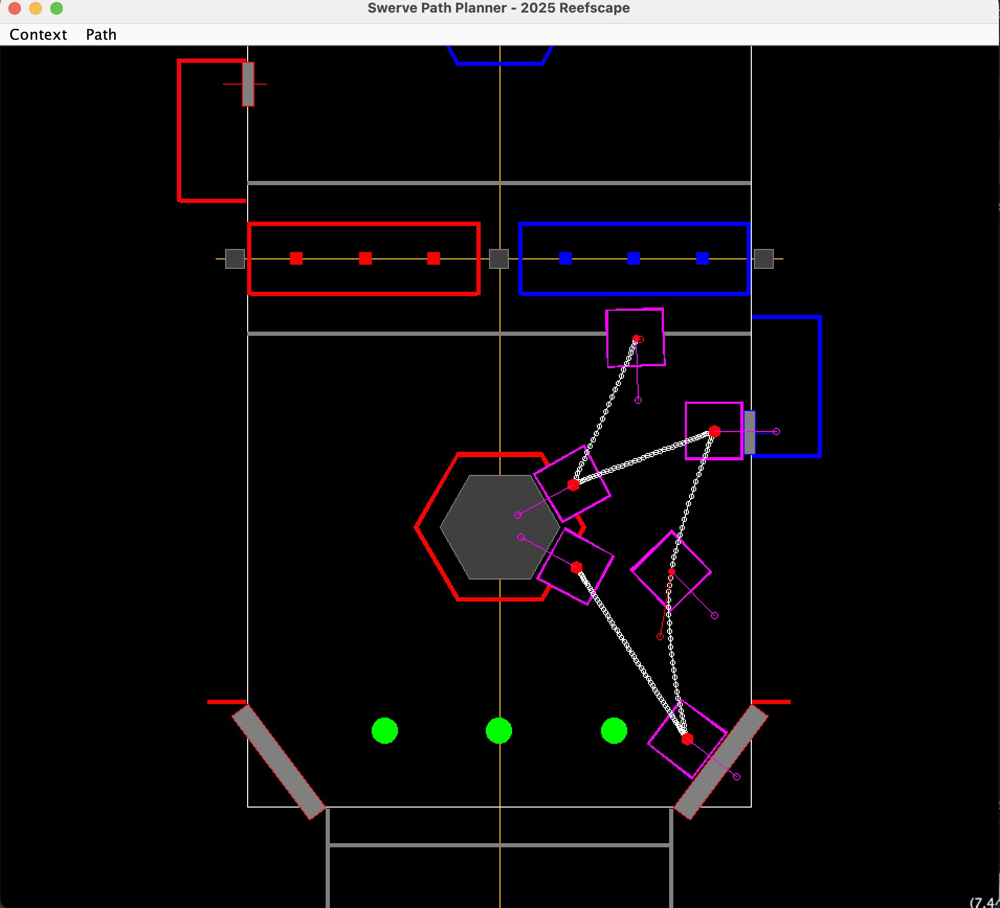

# Swerve Path Planning: 6831 A05annex


This project is a visual 2D editor for path planning for a swerve drive FRC robot. Read a robot description
and field description into this planner as a context for path planning, then draw, tune, and save a path
that can be used as a path input in the autonomous program.

## Path Spline

The path planner uses an implementation of the
[Kochanek-Bartels Spline](https://en.wikipedia.org/wiki/Kochanek%E2%80%93Bartels_spline) modified
for interactive editing of the tangent vector to implicitly control bias and tension. There is no
continuity control because we want our robot paths to be continous. The original reference for this
spline can be found at
[Interpolating Splines with Local Tension, Continuity, and Bias Control](https://www.engr.colostate.edu/ECE455/Readings/TCB.pdf)

When control points are created the tangent (derivatives) at that control point and surrounding
control points are computed using the [Cardinal-Spline](https://en.wikipedia.org/wiki/Cubic_Hermite_spline)
formulation with the default tension specified by a program constant. The tangent is adjusted using a
control handle which intuitively manipulates the shape of the spline at the control point to implicitly
edit tension and bias.

### Path Description Format

### Path Description Example

## Robot Description

The robot is described in a <tt>.json</tt> file read into the path planner and displayed as the robot during
the path planning, as well as providing the drive geometry and max speed for the modules of the swerve
drive. Having a good description of the robot is helpful in detecting collisions or near collisions
between the robot and game elements.

### Robot Description Format

The robot description is divided into 3 sections:
- **<tt>"title"</tt>**: (optional) A title or name for the robot, primarily used as file documentation to refresh
  you on the robot this file represents.
- **<tt>"description"</tt>**: (optional) A more verbose description if the robot, again primarily used as file
  documentation to refresh you on the robot this file represents.
- **<tt>"drive"</tt>**: (optional) describes the geometry of the drive
  - **<tt>"length"</tt>**: The length of the drive (pivot axis to pivot axis) in meters.
  - **<tt>"width"</tt>**: The width of the drive (pivot axis to pivot axis) in meters.
  - **<tt>"maxSpeed"</tt>**: Tha maximum module speed (meters/sec)
- **<tt>"chassis"</tt>**: (optional) describes the geometry of the chassis (it is currently assumed the drive
  and chassis share the same centroid)
  - **<tt>"length"</tt>**: The length of the chassis in meters.
  - **<tt>"width"</tt>**: The width of the chassis in meters.
- **<tt>"bumpers"</tt>**: (optional)
  - **<tt>"length"</tt>**: The length of robot with bumpers in meters.
  - **<tt>"width"</tt>**: The width of the robot with bumpers in meters.

### Example Robot Description file

```json
{
  "title": "prototype base, summer 2020",
  "description": "This is the prototype base for A05 annex, FRC 6831, our first experience programming a swerve drive",
  "drive": {
    "length": 0.574,
    "width": 0.577,
    "maxSpeed": 3.1951
  },
  "chassis": {
    "length": 0.762,
    "width": 0.762
  },
  "bumpers": {
    "length": 0.9144,
    "width": 0.9144
  }
}
```

## Field Description

The field is described in a <tt>.json</tt> file read into the path planner and displayed as the background
field context during path planning. To simplify field description there is a section of the description for
game <tt>components</tt> where you describe game elements like the scoring pieces, scoring targets, scoring
piece depots, etc; and a <tt>field</tt> section that lets you position components and describe which
alliance (if any) they belong to.

### Field Description Format

The field is described in a <tt>.json</tt> file read into the planner and displayed as the context
for planning move paths. The field description file has 4 main elements:
- **<tt>title</tt>**: (optional) A title or name for the field, primarily used as file documentation to refresh
  you on the field this file represents.
- **<tt>description</tt>**: (optional) A more verbose description if the field, again primarily used as file
  documentation to refresh you on the field this file represents.
- **<tt>"components"</tt>**: The list of field components (elements or assembles) that are generally specific
  to the competition for the year, and often appear multiple times on the field. Within this list are
  dictionaries describing the components as:
  - **<tt>"name"</tt>**: The name of the component. This name will be used in the field description to specify
    components to be added to the field and must be unique in the list of components.
  - **<tt>"lineColor"</tt>**: The outline color or <tt>null</tt> if no outline should be drawn,
    see [Color Description](#Color-Description).
  - **<tt>"fillColor"</tt>**: The fill color or <tt>null</tt> if the geometry should not be filled,
    see [Color Description](#Color-Description).
  - **<tt>"shapes"</tt>**: A list of shapes which will be rendered using the <tt>"lineColor"</tt> and
    <tt>"fillColor"</tt> directives, see [Shapes Description](#Shapes-Descriptions) for the formats of the
    shapes that are currently supported.
- **<tt>"field"</tt>**: The drawing of the field. By default, the path planner draws the field axes and outline.
  This section describes the things that should be drawn on the field, specifically: components as describes in
  the previous section and additional field geometry. Components are specified by name, an optional alliance color,
  and positioning translation and/or rotation.
  - **<tt>"components"</tt>**:
  - **<tt>"name"</tt>**: The name of the field, generally the name of this year's competition.
  - geometry - any of the generic geometry specifications described below.
  - **<tt>"addComponent"</tt>**:
    - **<tt>"alliance"</tt>**: The alliance color, <tt>"red"</tt>, <tt>"blue"</tt>, or <tt>"none"</tt> (the
      default if not specified) if the  component is a neutral component not associated with either alliance.
    - **<tt>"componentName"</tt>**: The name of the component
    - **<tt>"transform"</tt>**: The positioning transform to be applied to the component.

#### Color Description


#### Shapes Descriptions


### Example Field Description file

